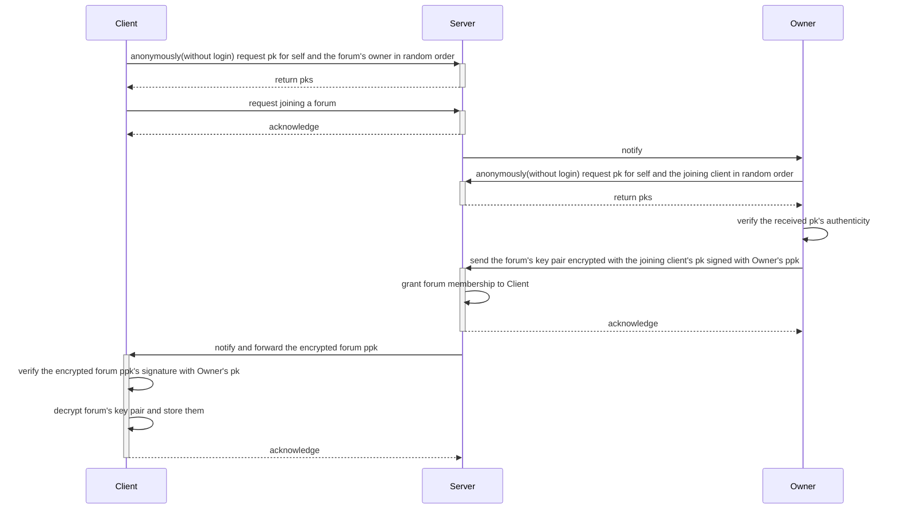

```mermaid
sequenceDiagram
    Client->>+Server: anonymously(without login) request pk for self and the forum's owner in random order
    Server-->>-Client: return pks
    Client->>+Server: request joining a forum
    Server-->>-Client: acknowledge
    Server->>Owner: notify
    Owner->>+Server: anonymously(without login) request pk for self and the joining client in random order
    Server-->>-Owner: return pks
    Owner->>Owner: verify the received pk's authenticity
    Owner->>+Server: send the forum's key pair encrypted with the joining client's pk signed with Owner's ppk
    Server->>Server: grant forum membership to Client
    Server-->>-Owner: acknowledge
    Server->>+Client: notify and forward the encrypted forum ppk
    Client->>Client: verify the encrypted forum ppk's signature with Owner's pk
    Client->>Client: decrypt forum's key pair and store them
    Client-->>-Server: acknowledge
```