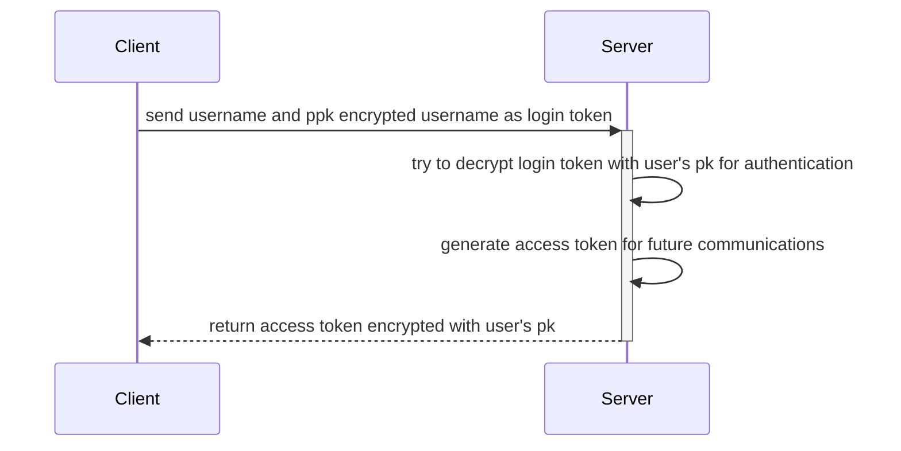

```mermaid
sequenceDiagram
    Client->>+Server: send username and ppk encrypted username as login token
    Server->>Server: try to decrypt login token with user's pk for authentication
    Server->>Server: generate access token for future communications
    Server-->>-Client: return access token encrypted with user's pk 
```