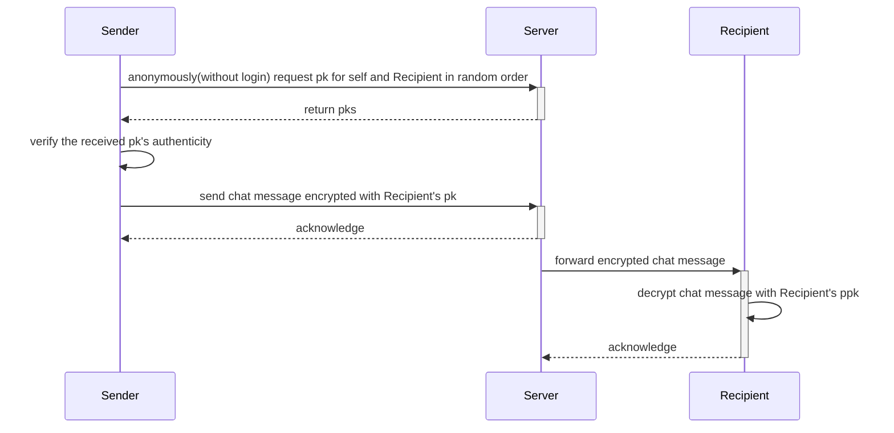

```mermaid
sequenceDiagram
    Sender->>+Server: anonymously(without login) request pk for self and Recipient in random order
    Server-->>-Sender: return pks
    Sender->>Sender: verify the received pk's authenticity
    Sender->>+Server: send chat message encrypted with Recipient's pk
    Server-->>-Sender: acknowledge
    Server->>+Recipient: forward encrypted chat message
    Recipient->>Recipient: decrypt chat message with Recipient's ppk
    Recipient-->>-Server: acknowledge
```