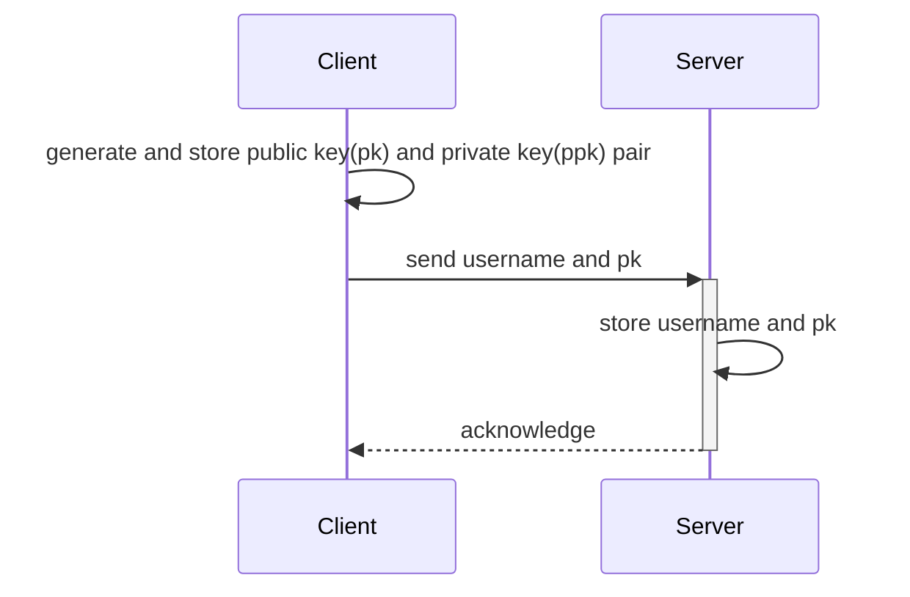

```mermaid
sequenceDiagram
    Client->>Client: generate and store public key(pk) and private key(ppk) pair
    Client->>+Server: send username and pk
    Server->>Server: store username and pk
    Server-->>-Client: acknowledge
```